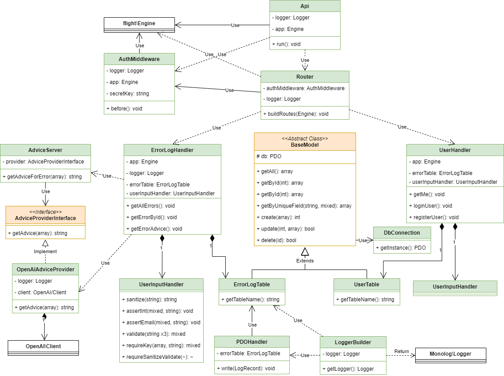

# Backend Structure

The `spoodler` folder contains the backend logic for Spoodler. Here's a high-level overview of the structure:

```
.
└── .env
└── .env.testing
└── composer.json
└── bootstrap
    └── config.php
    └── init.php
    └── test_init.php
└── classes
    └── advice
        └── AdviceProviderInterface.php
        └── AdviceService.php
        └── OpenAIAdviceProvider.php
    └── api
        └── Api.php
        └── exception
            └── client
                └── BadRequestException.php
                └── ClientException.php
                └── NotFoundException.php
                └── UnauthorizedException.php
            └── server
                └── InternalServerErrorException.php
                └── ServerException.php
        └── handler
            └── ErrorLogHandler.php
            └── UserHandler.php
        └── legacy
            └── ApiResponse.php
            └── control
                └── Handleable.php
                └── LegacyController.php
            └── Header.php
            └── render
                └── Json.php
                └── Renderable.php
                └── Text.php
            └── Request.php
        └── middleware
            └── AuthMiddleware.php
        └── Router.php
    └── db
        └── BaseModel.php
        └── DbConnection.php
        └── ErrorLogTable.php
        └── UserTable.php
    └── logger
        └── LoggerBuilder.php
        └── PDOHandler.php
    └── report
        └── LegacyHandler.php
    └── utils
        └── UserInputHandler.php
└── logs
    └── info.log
└── public
    └── index.php
    └── report.php
└── phpunit.xml
└── test
    └── api
        └── postman.json
    └── phpunit
        └── classes
            └── ...
└── vendor
    └── autoload.php
    └── ...
```

`.env`: Stores environment variables such as database credentials and other **sensitive** information. These values are used by the Docker services and the application.

`.env.testing`: Similar to `.env`, but used for testing purposes.

`composer.json`: Defines dependencies and autoloading for the application.

#### `bootstrap/`

- **`config.php`**: Contains global configuration settings for the application.
- **`init.php`**: Handles initialization for every endpoint.
- **`test_init.php`**: Handles initialization for testing.

#### `classes/`



Organized PHP classes for different functionalities:

- **advice/**

  - **AdviceProviderInterface.php**: Defines a contract for generating advice based on error reports. Ensures consistency across different advice providers.

  - **AdviceService.php**: Central service for retrieving advice. It uses a provider implementing `AdviceProviderInterface`, allowing flexibility to switch between different advice generation sources.

  - **OpenAIAdviceProvider.php**: Implements `AdviceProviderInterface` using OpenAI's API to generate contextual advice for error reports.

- **api/**

  - **exception/**: Contains custom exception classes for handling API errors, organized into client and server subfolders for precise error categorization and consistent HTTP response management.

  - **handler/**

    - **ErrorLogHandler.php**:  
      Manages operations related to error logs, including fetching all errors, retrieving specific error details, and generating contextual advice using OpenAI.

    - **UserHandler.php**:  
      Handles user-related operations such as authentication (`loginUser`), registration (`registerUser`), and user information retrieval (`getMe`). It securely manages user credentials using JWT for authentication.

  - **legacy/**: Contains legacy code for handling API requests and responses using the legacy API version.

  - **middleware/**

    - **AuthMiddleware.php**:  
      Manages authentication for protected API routes using JWT. It secures all `/api` endpoints except for public routes like login and registration.

  - **Api.php**:  
    Main entry point for the RESTful API. It initializes authentication and routing. It also handles error logging and standardized responses for client and server exceptions, ensuring consistent API behavior.

  - **Router.php**:  
    Defines and organizes API routes for error logging and user management. It integrates middleware for authentication and delegates request handling to the appropriate handlers, maintaining clean and modular route management.

- **db/**

  - **DbConnection.php**:  
    Implements a singleton pattern for establishing a database connection using PDO.

  - **BaseModel.php**:  
    Abstract base class for database models, providing reusable CRUD operations (`getAll`, `getById`, `create`, `update`, `delete`).

  - **ErrorLogTable.php**:  
    Extends `BaseModel` for operations on the `errors` table, inheriting all CRUD methods.

  - **UserTable.php**:  
    Extends `BaseModel` for operations on the `users` table, inheriting all CRUD methods.

- **logger/**

  - **LoggerBuilder.php**:  
    Configures and builds the logging system for Spoodler. It integrates Monolog with both file-based and database logging via `PDOHandler` custom handler. It also registers the logger as the global error and exception handler for consistent error tracking.

  - **PDOHandler.php**:  
    Custom Monolog handler that logs error details directly into the database using `ErrorLogTable`. It formats and sanitizes error information, ensuring organized and persistent error tracking.

- **report/**
  - **LegacyHandler.php**: Handles report requests to legacy API. It utilizes `ErrorLogTable` for database interactions and `UserInputHandler` for secure input processing.
- **utils/**
  - **UserInputHandler.php**: Ensures user input data integrity by sanitizing inputs, validating data types (e.g., integers, emails), and enforcing required fields. It throws appropriate exceptions for invalid or missing inputs, enhancing security and reliability in API requests.

#### `logs/`

Logs for the application. Contains general information and error logs.

#### `public/`

The public folder contains the entry point for the REST API and the report page.

#### `phpunit.xml`

PHPUnit configuration file for running unit and integration tests.

#### `test/`

Tests for the application.

- `postman.json`: Postman collection file for API testing.

- `phpunit/`: Unit and Integration tests for the application classes and methods.

#### `vendor/`:

Contains dependencies and libraries used by the application.
